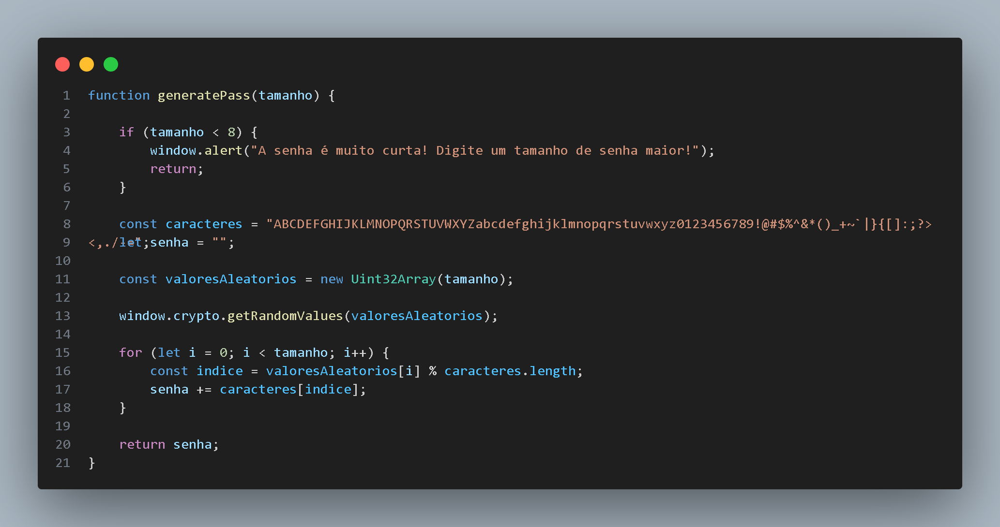

# 🔐 Pass Generator

Um gerador de senhas aleatórias limpo, moderno e focado em segurança, desenvolvido com tecnologias web fundamentais. O projeto utiliza criptografia nativa e validações inteligentes para garantir a integridade e a imprevisibilidade das senhas geradas.

---

## ✨ Funcionalidades

* **Geração Criptográfica:** Utiliza a **Crypto API** nativa do navegador para gerar entropia real, evitando a previsibilidade de funções comuns como `Math.random()`.
* **Validação de Segurança:** Bloqueia a geração de senhas inseguras menores que 8 caracteres, alertando o usuário imediatamente.
* **Design Responsivo & Centralizado:** Interface moderna construída com **Flexbox**, mantendo todos os elementos alinhados e limpos no topo da tela.
* **Truncamento de Texto Inteligente:** Senhas muito longas não quebram o layout, aplicando automaticamente o efeito de reticências (`...`).
* **Cópia com Um Clique:** Botão de copiar integrado à **Clipboard API** com feedback visual dinâmico (troca de ícones do Font Awesome ao copiar).
* **Links Educacionais:** Rodapé integrado com referências globais de cibersegurança.

---

## 🛠️ Tecnologias Utilizadas

O projeto foi construído do zero utilizando apenas a stack padrão da web (Vanilla):

* **HTML5:** Estruturação semântica do formulário e seções.
* **CSS3:** Estilização moderna utilizando Variáveis CSS (Custom Properties), Flexbox para alinhamento e efeitos de transição no hover.
* **JavaScript (ES6+):** Lógica de geração criptográfica, validações e manipulação de eventos do DOM.
* **Font Awesome (v7):** Ícones vetoriais dinâmicos para a interface de usuário.

---

## 🔒 Implementação do Algoritmo

Abaixo está a estrutura da função principal de geração, garantindo que o estado dos números aleatórios seja imune a ataques de previsão, interagindo diretamente com os recursos de ruído do sistema operacional:

---
Feito por Miguel A. Lenzi 
